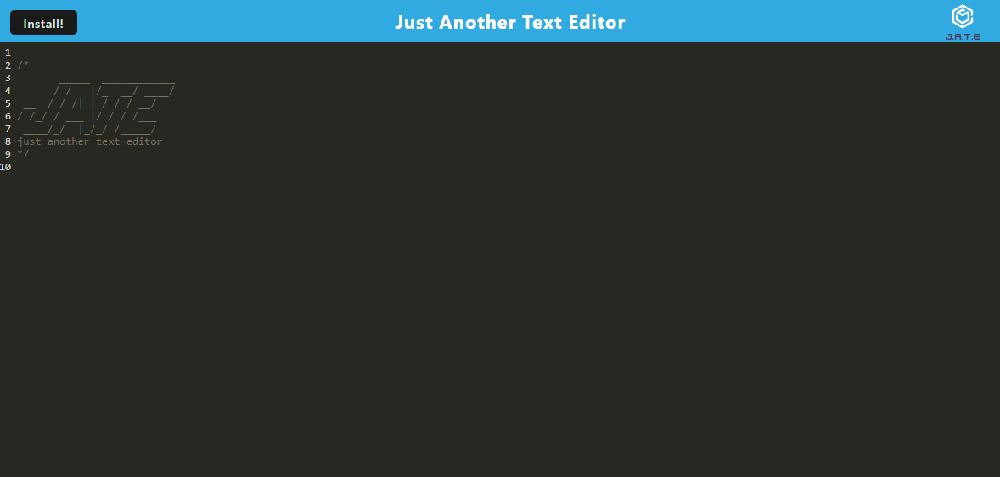

# PWA-Text-editor

## Description

This application was made to help take notes or write thoughts down without an internet connection.

## Table of Contents

- [Installation](#installation)
- [Usage](#usage)
- [License](#license)
- [Contributing](#contributing)
- [Tests](#tests)
- [Questions](#questions)

## Installation

To install, the user needs to clone the repo and run an npm i and npm run start. Once that is done the user can open the application and begin using it.

## Usage

## License

This project is license under MIT

## Contributing

At this time there is no need to contribute.

## Tests

n/a

## Questions

If you have any questions, please email me at Tyler.Kand2@gmail.com. You can also view more of my work at https://github.com/TylerKandarian.
